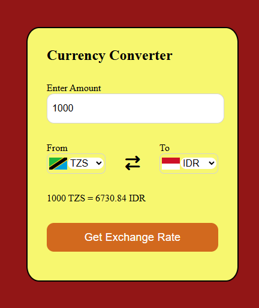

# 💱 Currency Converter

A simple and responsive **Currency Converter** built using **HTML, CSS, and JavaScript**. The application uses an exchange-rate API to fetch currency conversion data and dynamically updates the result based on the selected currencies and amount.

## 🚀 Live Demo

🔗 **[View Live Demo](https://amritasoni-dev.github.io/Currency-Converter/)**

## 📸 Preview



## ✨ Features

* 💱 Convert between multiple currencies
* 🌍 Supports a wide range of currency options
* 🚩 Displays country flags dynamically
* 🔄 Select different source and target currencies
* 💰 Enter any amount for conversion
* ⚡ Fetches exchange-rate data using an API
* 📱 Responsive and user-friendly interface
* 🎨 Simple and colorful UI

## 🛠️ Technologies Used

* **HTML5** — Structure of the application
* **CSS3** — Styling and responsive layout
* **JavaScript** — Application logic and DOM manipulation
* **Fetch API** — Fetching exchange-rate data
* **Currency API** — Providing exchange-rate information
* **Flags API** — Displaying country flags

## 📂 Project Structure

```text
Currency-Converter/
│
├── index.html
├── style.css
├── script.js
├── countryList.js
└── screenshot.png
```

## ⚙️ How It Works

1. Select the currency you want to convert **from**.
2. Select the currency you want to convert **to**.
3. Enter the amount you want to convert.
4. Click **Get Exchange Rate**.
5. The application fetches the latest available exchange-rate data from the API.
6. The converted amount is displayed on the screen.

## 🔌 API

This project uses the **Fawaz Ahmed Currency API** to retrieve exchange-rate information.

The application dynamically constructs the API request based on the selected source currency and then extracts the required target-currency rate from the returned JSON data.

## 📚 What I Learned

While building this project, I practiced:

* DOM manipulation
* Event listeners
* JavaScript functions
* `async/await`
* `fetch()`
* Working with APIs
* Handling JSON data
* Dynamic HTML element creation
* Template literals
* Basic responsive CSS
* Updating the UI dynamically

## 🧑‍💻 Author

**Amrita Soni**

* GitHub: [@amritasoni-dev](https://github.com/amritasoni-dev)
* LinkedIn: [Amrita Soni](https://www.linkedin.com/in/amrita-soni-002786/)

## ⭐ Support

If you found this project useful or interesting, consider giving it a ⭐ on GitHub!
